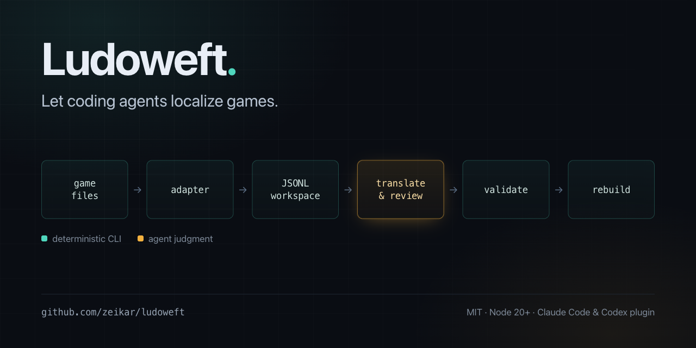

# Ludoweft



[](https://github.com/zeikar/ludoweft/actions/workflows/ci.yml)
[](LICENSE)
[](package.json)
[](#)

**Let coding agents localize games.**

Ludoweft is an agent-native pipeline for extracting, translating, validating, and rebuilding moddable game resources. It gives coding agents a deterministic CLI and a stable JSONL workspace while leaving game formats to adapters.

The repository is also an installable plugin for both Codex and Claude Code. Either plugin bundles the same orchestration skill and CLI, so a game project only needs its manifest, private resources, and translation workspace.

> Status: pre-alpha. The core contract, synthetic adapter, and first FreeMote info-PSB adapter work; adapter APIs may still change.

## Why

Localization tools usually focus on either resource editing or machine translation. Ludoweft connects the full engineering loop:

```text
game files -> adapter -> JSONL -> agent translation/review -> validation -> rebuild
```

The CLI does not call a model provider. Codex, Claude, or another compatible agent drives the workflow, may divide translation into non-overlapping batches, and uses Ludoweft for deterministic file operations and quality gates.

## Scope

The initial scope is file-based localization patches for text-heavy PC games — visual novels, adventure games, and other script-driven titles — whose resources can be extracted and rebuilt. It suits a community translation patch that ships translated text only. Runtime text hooking, OCR translation, and universal support for every engine are outside the initial scope.

Ludoweft never includes commercial game assets, extracted text, archive keys, or third-party tools that cannot be redistributed.

## Quick start

Requirements: Node.js 20 or newer.

```sh
npm test
npm run demo
```

The demo uses synthetic JSON data under `examples/demo` and exercises extraction, JSONL export, validation, translation application, build, and verification.

## Install as a Codex plugin

Add the GitHub repository as a Codex marketplace, then install Ludoweft:

```sh
codex plugin marketplace add zeikar/ludoweft
codex plugin add ludoweft@ludoweft
```

Start a new Codex thread after installation so the bundled skill is discovered. Open a localization project and ask Codex to inspect its `ludoweft.project.json`; the skill executes the plugin-bundled CLI without requiring `npm link` or a global Ludoweft install.

To follow updates from `main` during pre-alpha development:

```sh
codex plugin marketplace upgrade ludoweft
codex plugin add ludoweft@ludoweft
```

Release tags and stable version pinning will replace the moving `main` reference once the plugin contract stabilizes.

## Install as a Claude Code plugin

Add the repository as a marketplace, then install Ludoweft:

```sh
claude plugin marketplace add zeikar/ludoweft
claude plugin install ludoweft@ludoweft
```

Restart Claude Code so the bundled skill is discovered. Open a localization project and ask Claude to inspect its `ludoweft.project.json`; the skill runs the plugin-bundled CLI from `$CLAUDE_PLUGIN_ROOT`, so no global install or `npm link` is needed.

## CLI usage

Run individual stages:

```sh
node ./bin/ludoweft.mjs inspect --project ./examples/demo/ludoweft.project.json
node ./bin/ludoweft.mjs extract --project ./examples/demo/ludoweft.project.json
node ./bin/ludoweft.mjs export --project ./examples/demo/ludoweft.project.json
node ./bin/ludoweft.mjs validate --project ./examples/demo/ludoweft.project.json
node ./bin/ludoweft.mjs apply --project ./examples/demo/ludoweft.project.json
node ./bin/ludoweft.mjs build --project ./examples/demo/ludoweft.project.json
node ./bin/ludoweft.mjs verify --project ./examples/demo/ludoweft.project.json
```

Create an adapter-neutral project skeleton after choosing the adapter and language direction:

```sh
node ./bin/ludoweft.mjs init --adapter demo-json --source-language en --reference-language ja --target-language ko
```

`init` deliberately writes only the adapter-neutral core manifest. Before `inspect` can
succeed, add the selected adapter's project-authored profile. For `demo-json`, use
[`examples/demo/ludoweft.project.json`](examples/demo/ludoweft.project.json) as the
configuration reference. For `freemote-info-psb`, supply private `adapterConfig` and
`paths.freeMote` values; do not guess archive details, keys, or local tool paths.

Convert a separate legacy `ja`/`en`/`ko` JSONL tree before reconciling it with a fresh export:

```sh
node ./bin/ludoweft.mjs import-jsonl --format ja-en-ko-v1 --input ./legacy --output ./translations --dry-run
```

Non-empty imported targets are deliberately marked `draft`. Review and validate them,
then promote only accepted rows to `translated` or `reviewed` before building.

After `npm link`, the same commands are available through `ludoweft`.

## Project manifest

Each private localization project owns a `ludoweft.project.json` file:

```json
{
  "schemaVersion": 1,
  "id": "my-game-ko",
  "adapter": "my-engine",
  "languages": {
    "source": "ja",
    "reference": "en",
    "target": "ko"
  },
  "paths": {
    "source": "./game-data",
    "work": "./.ludoweft/work",
    "translations": "./translations",
    "output": "./dist"
  },
  "localConfig": "./ludoweft.local.json"
}
```

Installation paths, keys, tokens, and other machine-local values belong in the ignored `ludoweft.local.json`, never in a public manifest.

## Translation workspace

One JSON object per line keeps diffs small and lets agents work on separate files without rewriting a giant document:

```json
{"id":"dialogue:intro","source":"Welcome, {player}!","reference":"","target":"{player}님, 어서 오세요!","sourceHash":"...","protectedTokens":["{player}"],"status":"reviewed"}
```

Stable IDs and source hashes detect upstream changes. When `export` sees a segment whose source changed, it keeps the old translation for reuse but marks the segment `stale`, records `previousSource`, and `apply` refuses to build until it is revised. A segment whose source entry disappears upstream becomes `orphaned` rather than being deleted, so a patch that removes an entry never destroys reviewed work.

Only `translated` and `reviewed` segments reach a build. Protected tokens are recomputed from the adapter-selected `source` or `reference` slot under a named token profile at apply time, so editing `protectedTokens`, `protectedTokenSource`, or `protectedTokenProfile` in the workspace cannot bypass the check. The comparison runs in both directions — a placeholder the target invents is rejected alongside one it drops. The built-in `mages` profile also protects the engine's `%C`, `%p`, and escaped `%%C` controls when a resource opts into it.

`apply`, `build`, and `verify` all derive the resource they expect from the current sources and workspace, so an artifact left by an earlier run cannot be built or certified.

Schemas live in [`schemas/`](schemas/). Architecture and adapter boundaries are documented in [`docs/architecture.md`](docs/architecture.md), and the agent-side roles and data boundary in [`docs/agent-workflow.md`](docs/agent-workflow.md).

## FreeMote info-PSB adapter

`freemote-info-psb` supports paired `*_info.psb.m` and `*_body.bin` archives through separately installed FreeMote tools. It provides `mages-scenario` (MAGES engine scenario scripts) and `localized-string-array` content handlers plus constrained `appendUnique` and `merge` JSON mutations. Archive names, keys, language slots, file allowlists, and game-specific mutations remain in the private project; the public adapter contains no game assets or keys and never downloads FreeMote implicitly.

## Plugins and the agent skill

One skill serves both hosts. `skills/ludoweft-localize` describes the safe orchestration workflow, resolves its bundled CLI from whichever root its host provides, and keeps model judgment separate from resource operations.

| Host | Plugin manifest | Marketplace manifest |
|---|---|---|
| Codex | `.codex-plugin/plugin.json` | `.agents/plugins/marketplace.json` |
| Claude Code | `.claude-plugin/plugin.json` | `.claude-plugin/marketplace.json` |

The skill also carries per-engine references under `skills/ludoweft-localize/references/engines/`, which describe markup, font faces, and tag formats that hold across titles on one engine; a file for a new engine is a welcome pull request. Both hosts install the whole repository and discover skills at `skills/<name>/SKILL.md`, so the manifests declare no custom component paths. The core CLI stays agent-agnostic: packaging for another coding agent reuses the same `src/`, schemas, adapters, and workflow contract without touching game project data.

## Roadmap

- Add more independently tested content handlers and external adapter loading.
- Add transactional install and restore primitives.
- Model glossary, style-guide, batching, and review metadata in the workspace schema; the authoring guidance already ships with the skill.
- Add agent workflow evaluations and reproducible fixtures.
- Publish stable plugin and CLI releases through appropriate package channels.

## License

MIT
